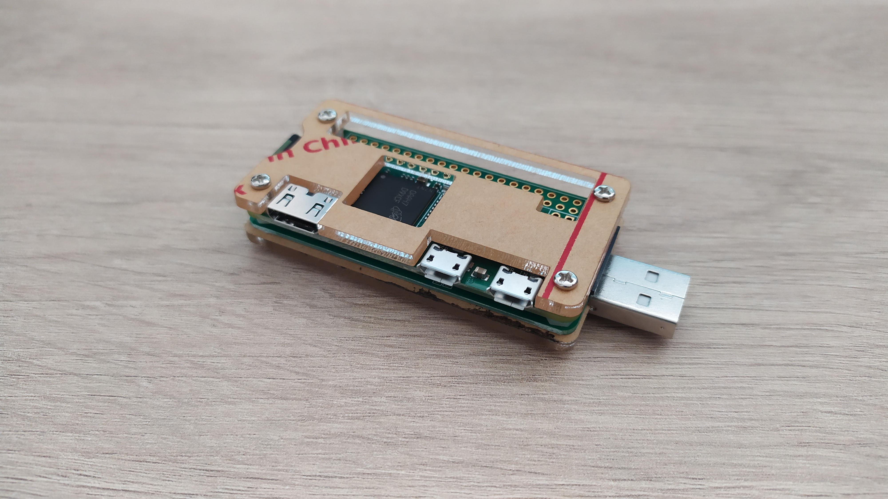

# Official website for the Terrible Hackiemos Crackt00l
This is the official website project for our tool.

# Specs
This website is a single page site, which means that all the content is in one only [index.html](#index.html) file:
```html
<!DOCTYPE html>
<html lang="en">
  <head>
    <meta charset="UTF-8" />
    <meta name="viewport" content="width=device-width, initial-scale=1.0" />
    <meta http-equiv="X-UA-Compatible" content="ie=edge" />
    <title>Terrible Hackiemos Crackt00l</title>
    <link rel="stylesheet" href="fontawesome-5.5/css/all.min.css" />
    <link rel="stylesheet" href="slick/slick.css">
    <link rel="stylesheet" href="slick/slick-theme.css">
    <link rel="stylesheet" href="magnific-popup/magnific-popup.css">
    <link rel="stylesheet" href="css/bootstrap.min.css" />
    <link rel="stylesheet" href="css/templatemo-style.css" />

  </head>
  <body>    
    <!-- Hero section -->
    <section id="hero" class="text-white tm-font-big tm-parallax">
      <!-- Navigation -->
      <nav class="navbar navbar-expand-md tm-navbar" id="tmNav">              
        <div class="container">   
          <div class="tm-next">
              <a href="#hero" class="navbar-brand">THC</a>
          </div>             

          <button class="navbar-toggler" type="button" data-toggle="collapse" data-target="#navbarSupportedContent" aria-controls="navbarSupportedContent" aria-expanded="false" aria-label="Toggle navigation">
            <i class="fas fa-bars navbar-toggler-icon"></i>
          </button>
          <div class="collapse navbar-collapse" id="navbarSupportedContent">
            <ul class="navbar-nav ml-auto">
              <li class="nav-item">
                  <a class="nav-link tm-nav-link" href="#introduction">Introduction</a>
              </li>
              <li class="nav-item">
                  <a class="nav-link tm-nav-link" href="#work">Our Work</a>
              </li>
              <li class="nav-item">
                  <a class="nav-link tm-nav-link" href="#contact">Contact Us</a>
              </li>                    
            </ul>
          </div>        
        </div>
      </nav>

      <div class="text-center tm-hero-text-container">
        <div class="tm-hero-text-container-inner">
            <h2 class="tm-hero-title">Terrible Hackiemos Crackt00l</h2>
            <p class="tm-hero-subtitle">
              Information site for the pentesting tool created by the Terrible Hackiemos
            </p>
        </div>        
      </div>

      <div class="tm-next tm-intro-next">
        <a href="#introduction" class="text-center tm-down-arrow-link">
          <i class="fas fa-3x fa-caret-down tm-down-arrow"></i>
        </a>
      </div>      
    </section>

    <section id="introduction" class="tm-section-pad-top">
      <div class="container">
        <div class="row">
          <div class="col-lg-6">
            
          </div>
          <div class="col-lg-6">
            <div class="tm-intro-text-container">
                <h2 class="tm-text-primary mb-4 tm-section-title">Introduction</h2>
                <p class="mb-4 tm-intro-text" align="justify">
              	Terrible Hackiemos Crackt00l is a pentesting tool based on a RaspberryPi Zero W using the P4wnp1 base system.
		This tool can be used for a variaty of cyber attacks such as: net analysys, file scarvation, etc.
		</p>
		<p class="mb-5 tm-intro-text" align="justify">
                  The project is still on development, so we are planning on imporving the
		  tool with a lot of new things, such as, an oled screen to make the analysis
		  without having to connect via <b><i>ssh</i></b> or web interface.
              </p>
                <div class="tm-next">
                  <a href="#work" class="tm-intro-text tm-btn-primary">Read More</a>
                </div>
            </div>
          </div>
        </div>
    </section>

    <section id="work" class="tm-section-pad-top">
      <div class="container tm-container-gallery">
        <div class="row">
          <div class="text-center col-12">
              <h2 class="tm-text-primary tm-section-title mb-4">Our Work</h2>
              <p class="mx-auto tm-work-description" align="justify">
              	The Terrible Hackiemos Crackt00l, which has been developed by Ernest Anguera and Isaac León, is a cracking tool
		that has been designed to find vulnerabilities inside the IT systems so that they can be fixed for future attacks.
		Our main goal is to make information technology services safer against cybercriminals such as Crackers, Scammers or even Cyber Terrorists.
	      </p>
          </div>

        </div>

        <div class="row tm-section-pad-top">
          <div class="col-lg-6">
            <i class="fab fa-4x fa-github text-center tm-icon"></i>
	    <h4 class="text-center tm-text-primary mb-4"><a href="https://github.com/eur1p3des/THC.git">Github Repository</a></h4>
            <p align="justify">
            	In order to make it easier to access to our files in case we want to modify
	    	them, we have created a Github repository with all the information related to
	    	the project.
            </p>
          </div>

          <div class="col-lg-6 mt-5 mt-lg-0">
	    <i class="fas fa-4x fa-robot text-center tm-icon"></i>
	    <!--</img>-->
	    <h4 class="text-center tm-text-primary mb-4"><a href="http://172.16.0.1:8000">Terrible Hackiemos Crackt00l</a></h4>
            <p align="justify">
            	In order to run the scripts and programs we have created there is a web interface where
		we can access all the configuration of the tool without needing to connect via ssh. In this
		site, we can also modify most of the scripts, although it is not possible to modify the site
		itself, to do this it is imprescindible to access the tool via ssh.
            </p>
          </div>
      </div>        


		<div class="row">
            <div class="col-12">
                <div class="mx-auto tm-gallery-container">
                    <div class="grid tm-gallery">
                      <a href="img/gallery-img-01.jpg">
                        <figure class="effect-honey tm-gallery-item">
                          
                          <figcaption>
                            <h2><i>Dreamy <span>Honey</span> Now</i></h2>
                          </figcaption>
                        </figure>
                      </a>
                      <a href="img/gallery-img-02.jpg">
                        <figure class="effect-honey tm-gallery-item">
                          
                          <figcaption>
                            <h2><i>Second <span>Honey</span> Now</i></h2>
                          </figcaption>
                        </figure>
                      </a>
                      <a href="img/gallery-img-03.jpg">
                        <figure class="effect-honey tm-gallery-item">
                          
                          <figcaption>
                            <h2><i>Third <span>Honey</span> Now</i></h2>
                          </figcaption>
                        </figure>
                      </a>
                      <a href="img/gallery-img-04.jpg">
                        <figure class="effect-honey tm-gallery-item">
                          
                          <figcaption>
                            <h2><i>Dreamy <span>Honey</span> Now</i></h2>
                          </figcaption>
                        </figure>
                      </a>
                      <a href="img/gallery-img-05.jpg">
                        <figure class="effect-honey tm-gallery-item">
                          
                          <figcaption>
                            <h2><i>Fifth <span>Honey</span> Now</i></h2>
                          </figcaption>
                        </figure>
                      </a>
                      <a href="img/gallery-img-06.jpg">
                        <figure class="effect-honey tm-gallery-item">
                          
                          <figcaption>
                            <h2><i>Sixth <span>Honey</span> Now</i></h2>
                          </figcaption>
                        </figure>
                      </a>
                      <a href="img/gallery-img-01.jpg">
                        <figure class="effect-honey tm-gallery-item">
                          
                          <figcaption>
                            <h2><i>Dreamy <span>Honey</span> Now</i></h2>
                          </figcaption>
                        </figure>
                      </a>
                      <a href="img/gallery-img-02.jpg">
                        <figure class="effect-honey tm-gallery-item">
                          
                          <figcaption>
                            <h2><i>Eighth <span>Honey</span> Now</i></h2>
                          </figcaption>
                        </figure>
                      </a>
                    </div>
                </div>                
            </div>        
          </div>
      </div>
    </section>

    <!-- Contact -->
    <section id="contact" class="tm-section-pad-top tm-parallax-2">
      <div class="container tm-container-contact">
        <div class="row">
            <div class="col-12">
                <h2 class="mb-4 tm-section-title">Contact Us</h2>
                <div class="mb-5 tm-underline">
                  <div class="tm-underline-inner"></div>
                </div>
                <p class="mb-5">
                  In order to contact us, you have several options. We leave you our email
		  addresses if you want to contact us via email, you also have our phone number
		  and you even have our location so that you can come and ask us anything personally.
		</p>
            </div>

            <div class="col-sm-12 col-md-6 d-flex align-items-center tm-contact-item">
              <a href="tel:0100200340" class="tm-contact-item-link">
                  <i class="fas fa-3x fa-phone mr-4"></i>
                  <span class="mb-0">010-020-0340</span>
              </a>              
            </div>
            <div class="col-sm-12 col-md-6 d-flex align-items-center tm-contact-item">
              <a href="mailto:ernest.anguera.7e3@itb.cat" class="tm-contact-item-link">
                  <i class="fas fa-3x fa-envelope mr-4"></i>
                  <span class="mb-0">ernest.anguera.7e3@itb.cat</span>
              </a>              
	    </div>   

	    <div class="col-sm-12 col-md-6 d-flex align-items-center tm-contact-item">
              <a href="https://www.google.com/maps/place/Institut+Tecnol%C3%B2gic+de+Barcelona/@41.4531987,2.1865311,15z/data=!4m5!3m4!1s0x0:0x3c4e7db0a61a83e0!8m2!3d41.4531814!4d2.1866493" class="tm-contact-item-link">
                  <i class="fas fa-3x fa-map-marker-alt mr-4"></i>
                  <span class="mb-0">Location on Maps</span>
              </a>              
            </div>

	    <div class="col-sm-12 col-md-6 d-flex align-items-center tm-contact-item">
	      <a href="mailto:isaac.leon.7e3@itb.cat" class="tm-contact-item-link">
                  <i class="fas fa-3x fa-envelope mr-4"></i>
                  <span class="mb-0">isaac.leon.7e3@itb.cat</span>
              </a>              
            </div>

            <div class="col-sm-12 col-md-12 d-flex align-items-center tm-contact-item">
              <form action="" method="get">
                <input name="email" type="email" placeholder="Subscribe your email" class="tm-input" required />
                <button type="submit" class="btn tm-btn-submit">Submit</button>
              </form>
            </div>
        </div>
      </div>
      <footer class="text-center small tm-footer">
          <p class="mb-0">
            Copyright &copy; 2019 Company Name

            - Design: <a rel="nofollow" href="https://templatemo.com" class="tm-footer-link">Template Mo</a>
          </p>
        </footer>
    </section>
    <script src="js/jquery-1.9.1.min.js"></script>     
    <script src="slick/slick.min.js"></script>
    <script src="magnific-popup/jquery.magnific-popup.min.js"></script>
    <script src="js/jquery.singlePageNav.min.js"></script>     
    <script src="js/bootstrap.min.js"></script>
    <script>

      function getOffSet(){
        var _offset = 450;
        var windowHeight = window.innerHeight;

        if(windowHeight > 500) {
          _offset = 400;
        }
        if(windowHeight > 680) {
          _offset = 300
        }
        if(windowHeight > 830) {
          _offset = 210;
        }

        return _offset;
      }

      function setParallaxPosition($doc, multiplier, $object){
        var offset = getOffSet();
        var from_top = $doc.scrollTop(),
          bg_css = 'center ' +(multiplier * from_top - offset) + 'px';
        $object.css({"background-position" : bg_css });
      }

      // Parallax function
      // Adapted based on https://codepen.io/roborich/pen/wpAsm        
      var background_image_parallax = function($object, multiplier, forceSet){
        multiplier = typeof multiplier !== 'undefined' ? multiplier : 0.5;
        multiplier = 1 - multiplier;
        var $doc = $(document);
        // $object.css({"background-attatchment" : "fixed"});

        if(forceSet) {
          setParallaxPosition($doc, multiplier, $object);
        } else {
          $(window).scroll(function(){          
            setParallaxPosition($doc, multiplier, $object);
          });
        }
      };

      var background_image_parallax_2 = function($object, multiplier){
        multiplier = typeof multiplier !== 'undefined' ? multiplier : 0.5;
        multiplier = 1 - multiplier;
        var $doc = $(document);
        $object.css({"background-attachment" : "fixed"});
        $(window).scroll(function(){
          var firstTop = $object.offset().top,
              pos = $(window).scrollTop(),
              yPos = Math.round((multiplier * (firstTop - pos)) - 186);              

          var bg_css = 'center ' + yPos + 'px';

          $object.css({"background-position" : bg_css });
        });
      };

      $(function(){
        // Hero Section - Background Parallax
        background_image_parallax($(".tm-parallax"), 0.30, false);
        background_image_parallax_2($("#contact"), 0.80);   

        // Handle window resize
        window.addEventListener('resize', function(){
          background_image_parallax($(".tm-parallax"), 0.30, true);
        }, true);

        // Detect window scroll and update navbar
        $(window).scroll(function(e){          
          if($(document).scrollTop() > 120) {
            $('.tm-navbar').addClass("scroll");
          } else {
            $('.tm-navbar').removeClass("scroll");
          }
        });

        // Close mobile menu after click
        $('#tmNav a').on('click', function(){
          $('.navbar-collapse').removeClass('show');
        })

        // Scroll to corresponding section with animation
        $('#tmNav').singlePageNav();        

        // Add smooth scrolling to all links
        // https://www.w3schools.com/howto/howto_css_smooth_scroll.asp
        $("a").on('click', function(event) {
          if (this.hash !== "") {
            event.preventDefault();
            var hash = this.hash;

            $('html, body').animate({
              scrollTop: $(hash).offset().top
            }, 400, function(){
              window.location.hash = hash;
            });
          } // End if
        });

        // Pop up
        $('.tm-gallery').magnificPopup({
          delegate: 'a',
          type: 'image',
          gallery: { enabled: true }
        });

        // Gallery
        $('.tm-gallery').slick({
          dots: true,
          infinite: false,
          slidesToShow: 5,
          slidesToScroll: 2,
          responsive: [
          {
            breakpoint: 1199,
            settings: {
              slidesToShow: 4,
              slidesToScroll: 2
            }
          },
          {
            breakpoint: 991,
            settings: {
              slidesToShow: 3,
              slidesToScroll: 2
            }
          },
          {
            breakpoint: 767,
            settings: {
              slidesToShow: 2,
              slidesToScroll: 1
            }
          },
          {
            breakpoint: 480,
            settings: {
              slidesToShow: 1,
              slidesToScroll: 1
            }
          }
        ]
        });
      });
    </script>
  </body>
</html>
```
